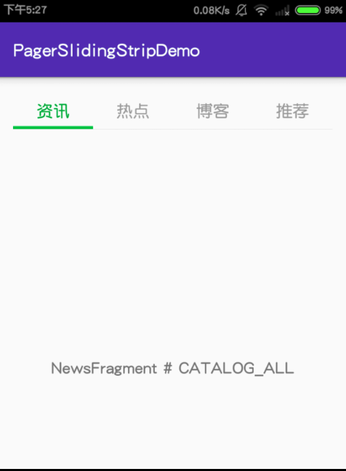

PagerSlidingTabStripDemo



You may like this: [Defining custom attrs](http://stackoverflow.com/questions/3441396/defining-custom-attrs)

and this: [Creating a View Class](https://developer.android.com/training/custom-views/create-view.html)

###1. Define these attrs.

#####res/values/attrs.xml
```xml
<resources>
	<declare-styleable name="PagerSlidingTabStrip">
	    <attr name="slidingBlock" format="reference|color" />
	    <attr name="allowWidthFull" format="boolean" />
	    <attr name="disableViewPager" format="boolean" />
	</declare-styleable>
</resources>
```

#####res/values/theme_attrs.xml
```xml
<resources>
	<attr name="windows_bg" format="reference" />
	<attr name="sliding_block_bg" format="reference" />
	<attr name="lineColor" format="reference" />
</resources>
```
---

###2. Give these attrs real values.
#####res/values/styles.xml
```xml
<style name="AppTheme" ...>
	...
	<item name="lineColor">@color/day_line_color</item>
	<item name="windows_bg">@color/day_windows_bg</item>
	<item name="sliding_block_bg">@drawable/image_sliding_block</item>
</style>
```

#####res/values/theme_color.xml
```xml
<?xml version="1.0" encoding="utf-8"?>
<resources>
	<color name="day_line_color">#e7e7e7</color>
	<color name="day_windows_bg">#fafafa</color>
</resources>
```

#####res/drawable/image_sliding_block.9.png

AndroidManifest.xml
```xml

<application
	...
	android:theme="@style/AppTheme">

	<activity ...>
	...
	</activity>
</application>

```

###3. Use it in layout xml file, like `app:slidingBlock="?attr/sliding_block_bg"`.
            
> Normally there is only `xmlns:android="http://schemas.android.com/apk/res/android".` 

> You must now also add `xmlns:whatever="http://schemas.android.com/apk/res-auto".` Here `whatever` must remain the same when you use it in content.

#####res/layout/base_viewpage_fragment.xml
```xml
<RelativeLayout xmlns:android="http://schemas.android.com/apk/res/android"
    xmlns:app="http://schemas.android.com/apk/res-auto"
    android:layout_width="match_parent"
    android:layout_height="match_parent">

<org.*.PagerSlidingTabStrip
	...
	android:background="?attr/windows_bg"
	app:allowWidthFull="true"
	app:slidingBlock="?attr/sliding_block_bg"/>

<View
	...
	android:background="?attr/lineColor" />
```

Finally, to access that custom attribute you normally do so in the constructor of your custom view as follows.

```java
public MyCustomView(Context context, AttributeSet attrs, int defStyle) {
  super(context, attrs, defStyle);

  TypedArray a = context.obtainStyledAttributes(attrs, R.styleable.MyCustomView, defStyle, 0);

  String str = a.getString(R.styleable.MyCustomView_my_custom_attribute);

  //do something with str

  a.recycle();
}

```
